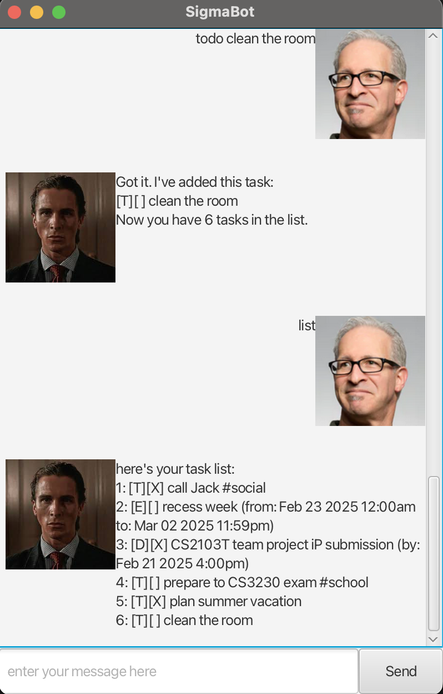

# Sigmabot User Guide



A brand new intuitive CLI-friendly chat empowering users to keep notes and organize tasks.

## Features
* Task management
    * Add tasks of three types: todo, deadline, and event.
    * Specify the date and time for deadlines and events.
* CLI
    * Your typing speed greatly outmatches your GUI orientation? Sigmabot got you!
    * We also prefer old school keyboard typing to modern day fancy graphics and limitless mouse clicking.
    * That's why we employed a proper command line interface for you to deploy your typing in full.
* Task storage
  * Your tasks will not only be stored in the bot itself, but also on your computer. Now you will never lose your tasks if you close the application.
  * The bot will automatically load your tasks from `data/data.json` and save them there whenever you modify your task list.
* Lookup and tagging
  * If you keep forgetting what the next thing you'd fancy doing is, you can always look up your tasks by a keyword, a date or a tag.

## Exiting the application

We're honest about our software. We recognize that the first thing a user might want to do after seeing our product is to close it. We've made it simple for you.

Command:
```
> bye
```

## Listing tasks

Command:
```
> list
```

Shows the current list of tasks.

Example output:
```
here's your task list:
1. [T][X] call Jack #social
2. [E][ ] recess week (from: Feb 23 2025 12:00 am to: Mar 02 2025 11:59pm)
3. [D][X] CS2103T team project iP submission (by: Feb 21 2025 4:00 pm)
4. [T][ ] prepare to CS3230 exam #school
```

## Adding tasks

Command:
```
> [task type] [name] [/argument1 value1] [/argument2 value2] ...
```

### Adding todo tasks

Example of usage
```
> todo call Jack
```

Example output:
```
Got it. I've added this task:
[T][ ] call Jack
Now you have 7 tasks in the list.
```

### Adding deadlines

Creates a deadline task with the specified date and time. Takes a date as an argument `/by` in the format `yyyy-MM-dd HH:mm`.

Example of usage:
```
> deadline CS2103T assignment /by 2021-09-17 23:59
```

Example output:
```
Got it. I've added this task:
[D][ ] CS2103T assignment (by: Sep 17 2021 11:59pm)
Now you have 7 tasks in the list.
```

### Adding events:

Creates an event task with the specified date and time. Takes arguments `/from` and `to` in the format `yyyy-MM-dd HH:mm`.

Example of usage:
```
> event CS2103T lecture /from 2021-09-17 14:00 /to 2021-09-17 16:00
```

Example output:
```
Got it. I've added this task:
[E][ ] CS2103T lecture (from: Sep 17 2021 2:00pm to: Sep 17 2021 4:00pm)
Now you have 7 tasks in the list.
```

## Marking/unmarking tasks as done

You can mark your tasks as done or mark back as undone.

Syntax:

```
> [mark/unmark] [task number]
```

Example of usage:

```
> mark 1
```
Example output:
```
marked task 4: [T][X] prepare to CS3230 exam #school
```

## Deleting tasks

If you're so done with task that you wish to delete it, you can do so by typing in the following command:

```
> delete [task number]
```

Example of usage:

```
> delete 7
```
Example output:
```
removed task 7: [T][ ] call Jack
you've got 6 tasks so far
```

## Finding tasks

If you have so many tasks that you're lost, Sigmabot can help you find them.

```
> find [keyword]
```

Example of usage:

```
> find CS2103T
```

Example output:
```
Here are the matching tasks in your list:
3: [D][X] CS2103T team project iP submission (by: Feb 21 2025 4:00 pm)
```

## Tagging:

You can tag your tasks to make orientation and search easier.

Syntax:

```
> tag [task number] [tag name]
```

or

```
> untag [task number]
```

Example of usage:

```
> tag 1 #social
```

Example output:
```
Updated the tag for task 1: [T][X] call Jack #social
```

Later you can look up tasks by a tag. By typing

```angular2html
> find #social
```

you will get:

```angular2html
Here are the matching tasks in your list:
1: [T][X] call Jack #social
```

# Got any feedback?

Loved Sigmabot? Hated it? We'd be desperate to hear from you. Feel free to open an issue anytime you wish so!